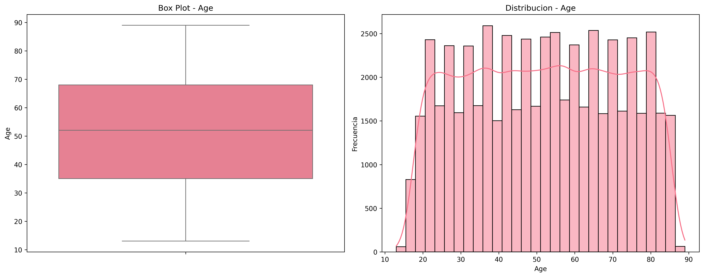
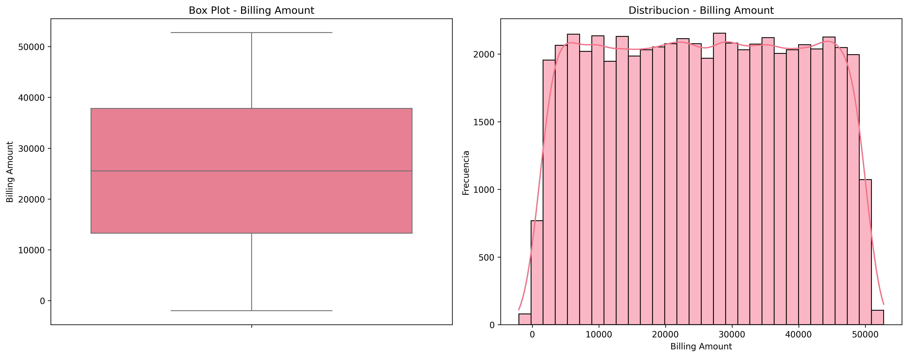
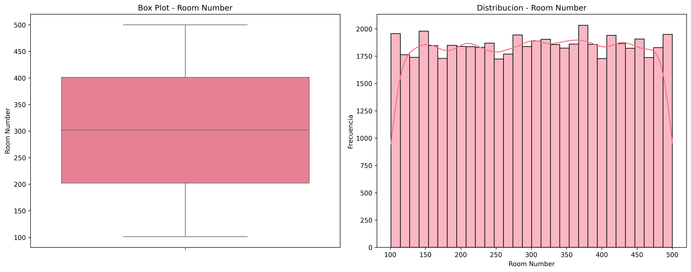
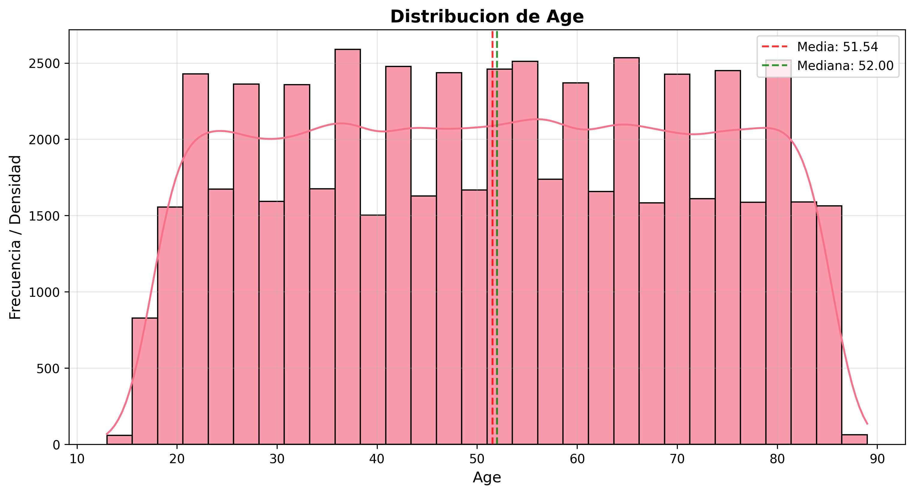
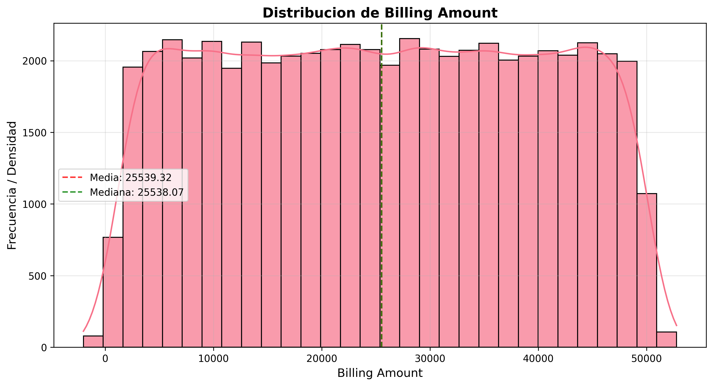

# Análisis Exploratorio de Datos - Dataset Healthcare

## Resumen Ejecutivo

Este documento presenta los resultados del análisis exploratorio inicial del dataset `healthcare_dataset.csv`, incluyendo la revisión de valores faltantes, detección de valores atípicos y análisis de distribuciones de variables numéricas.

## 1. Revisión de Valores Faltantes

✅ **No se encontraron valores faltantes** en ninguna de las columnas del dataset.

Esto indica que el dataset está completo y no requiere tratamiento para datos ausentes.

## 2. Detección de Valores Atípicos

Se analizaron las siguientes variables numéricas utilizando métodos gráficos (box plots) y estadísticos (método IQR):

### Age
✅ **No se detectaron outliers** en esta variable.
- Total de observaciones: 0 outliers
- Porcentaje: 0.00%
- Límites IQR: [-14.50, 117.50]

### Billing Amount
✅ **No se detectaron outliers** en esta variable.
- Total de observaciones: 0 outliers
- Porcentaje: 0.00%
- Límites IQR: [-23627.70, 74689.43]

### Room Number
✅ **No se detectaron outliers** en esta variable.
- Total de observaciones: 0 outliers
- Porcentaje: 0.00%
- Límites IQR: [-96.50, 699.50]

## 3. Análisis de Distribuciones

Se exploró la forma de las variables numéricas mediante histogramas y curvas de densidad:

### Age
- **Media**: 51.54
- **Mediana**: 52.00
- **Desviación Estándar**: 19.60
- **Skewness**: -0.01 (aproximadamente simétrica hacia la izquierda)
- **Kurtosis**: -1.19 (platicúrtica (picos menos pronunciados))

La diferencia entre media (51.54) y mediana (52.00) indica sesgo hacia la izquierda.

### Billing Amount
- **Media**: 25539.32
- **Mediana**: 25538.07
- **Desviación Estándar**: 14211.45
- **Skewness**: -0.00 (aproximadamente simétrica hacia la izquierda)
- **Kurtosis**: -1.19 (platicúrtica (picos menos pronunciados))

La diferencia entre media (25539.32) y mediana (25538.07) indica sesgo hacia la derecha.

### Room Number
- **Media**: 301.13
- **Mediana**: 302.00
- **Desviación Estándar**: 115.24
- **Skewness**: -0.01 (aproximadamente simétrica hacia la izquierda)
- **Kurtosis**: -1.19 (platicúrtica (picos menos pronunciados))

La diferencia entre media (301.13) y mediana (302.00) indica sesgo hacia la izquierda.

## 4. Conclusiones y Recomendaciones

### Hallazgos Principales:

- ✅ **Dataset completo**: No se encontraron valores faltantes en ninguna columna

- ✅ **Sin outliers**: No se detectaron valores atípicos en las variables analizadas

### Recomendaciones:

1. **Limpieza de datos**: El dataset está en buenas condiciones para análisis posteriores
2. **Transformaciones**: Evaluar si las distribuciones sesgadas requieren transformaciones logarítmicas o de Box-Cox
3. **Análisis adicional**: Considerar análisis de correlaciones entre variables numéricas
4. **Validación**: Los outliers detectados (si los hay) deben evaluarse en el contexto del dominio médico

### Próximos Pasos:
- Análisis de variables categóricas
- Análisis de correlaciones
- Preparación de datos para modelado
- Análisis estadístico inferencial

---
*Análisis generado automáticamente - Dataset Healthcare*
